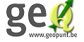

Geopunt4Qgis
============

 
Functies
--------

  * <a href="http://warrieka.github.io/index.html#!geopuntAddress.md" > Zoek een Adres</a> 
  * <a href="http://warrieka.github.io/index.html#!geopuntReverse.md" > Prik een Adres op kaart</a>
  * <a href="http://warrieka.github.io/index.html#!geopuntBatchgeocode.md" > CSV-adresbestanden geocoderen</a>
  * <a href="http://warrieka.github.io/index.html#!geopuntPoi.md" > Zoek een Plaats - interesse punt</a>
  * <a href="http://warrieka.github.io/index.html#!geopuntGIPOD.md" > GIPOD</a>
 
Systeem vereisten
-----------------

- QGIS 2.0 of hoger
- Python 2.7 (wordt geïnstalleerd met qgis)
- Elk besturingssysteem dat QGIS met python plug-ins ondersteund: ea. MS Windows, Mac OSX en Linux
- Vereist internet connectie, restrictieve firewalls kunnen mogelijk de connectie blokkeren

Doelstelling
-----------

geopunt4Qgis - *"Geopunt voor QGIS"* is een plugin voor de [QGIS](http://www.qgis.org/) open source desktop GIS. 

Het Vlaamse Geoportaal Geopunt bied een aantal geografische diensten (web-services) aan die mogen gebruikt worden door derden zoals andere overheden en bedrijven.

De kaartdiensten zijn gebaseerd op de OGC open standaard WMS of WMTS en kunnen gemakkelijk worden toegevoegd aan desktop GIS. GIS-gebruikers kunnen deze diensten ontdekken via het [metadacenter](https://metadata.geopunt.be/zoekdienst/apps/tabsearch/index.html).

Sommige diensten aangeboden door geopunt zijn niet gebaseerd op een open standaard omdat het gaat om diensten die geen  open standaard hebben. Deze publieke webdiensten zijn opgesteld volgens een REST-volle API, die eenvoudiger in gebruik is voor programmeurs dan OGC-diensten. Maar omdat ze niet gestandaardiseerd zijn kunnen ze niet zomaar binnen getrokken worden in desktop software.

Het gaat onder andere over:

- **Geocoding** gebaseerd op de officiële [CRAB](http://www.agiv.be/gis/projecten/?catid=34) adressen-databank
- **Locaties zoeken** door koppeling van adressen aan de crab-databank, bijvoorbeeld de scholendatabank van de Vlaamse overheid. (documentatie  nog niet beschikbaar)
- **Innames van openbaar domein** van het Generiek Informatieplatform Openbaar Domein (GIPOD)  [GIPOD](hhttp://gipod.api.agiv.be/#!index.md), de officiële databank met manifestaties, wegenwerken en andere obstructies op het openbaar domein.

Het van dit project om deze informatie te ontsluiten naar desktop QGIS-gebruikers, voor gebruik in papieren kaarten en voor het doen van analyse en onderzoek.

Use cases
----------

- De diensten zijn toegankelijk via een interactieve dialoog, geopend wanneer de gebruiker op een knop of menu-item klikt.
- De dialogen kunnen worden gebruikt en de gegevens kunnen worden weergegeven op elke ondersteund Spatial Reference System, niet alleen het Belgische Lambert 1972 (EPSG: 31370) of WGS84.
- De gebruiker kan een "tekst" zoekopdracht in voeren en indien beschikbaar, ook andere zoekopties toevoegen zoals een geografisch gebied.
- De gebruiker krijgt een lijst met resultaten voor de zoekopdracht en kan zoomen op een ​selectie van deze lijst, om te kunnen beoordelen of de variabele de gewenste data is.
- De gebruiker kan het juiste zoekresultaat selecteren in het dialoogvenster en toevoegen in kaart.

Wat is Geopunt ?
--------------

[Geopunt](http://www.geopunt.be/) is de centrale toegangspoort tot geografische overheidsinformatie, en het uithangbord van het samenwerkingsverband voor geografische informatie in Vlaanderen (GDI-Vlaanderen). Het portaal richt zich met een uitgebreid data-, diensten- en toepassingenaanbod naar een breed en divers publiek. Van burgers op zoek naar een geschikte bouwgrond tot de GIS-coördinator of het studiebureau die een milieu-studie wensen uit te voeren. Het geoportaal maakt laagdrempelig gebruik van geografische informatie door zowel overheidsinstanties, burgers, organisaties als bedrijven mogelijk. Maatschappelijk relevante geografische gegevens en diensten worden op een slimme en gebruiksvriendelijke wijze bijeengebracht.   

Alle componenten (metadata-cataloog, downloadapplicatie, e-commerce-applicatie, data en netwerkdiensten) worden rechtstreeks en geïntegreerd aangeboden. Het geoportaal vormt het Vlaams knooppunt in een Europese geografische data-infrastructuur en voldoet aan de vereisten van de [European INSPIRE richtlijn](http://inspire-geoportal.ec.europa.eu/).

Geopunt is de website van het samenwerkingsverband voor geografische informatie binnen de Vlaamse overheid, GDI-Vlaanderen (GDI = Geografische Data Infrastructuur). In de rol van geografische dienstenintegrator en als uitvoerend orgaan van het samenwerkingsverband GDI-Vlaanderen staat het Agentschap voor Geografische Informatie Vlaanderen (AGIV) in voor de realisatie en het onderhoud van Geopunt. 

Over de auteur
-------------

Ik ben geodata analyst en occasioneel programmeur, werkzaam bij de Studiedienst van stad Antwerpen. 
Naast geohacking en kaartjes maken, houd ik van lezen, film kijken en reizen.

Professioneel werk ik op webmapping met ESRI arcgis-server of Mapbox Tilemill. Ik beheer ook mee de centrale geodatabases van het stad en INSPIRE-compliant metadata in kader van GDI, Voor de rest doe ik vooral allerlei GIS analyses op data van het Stad. De meeste analyses zijn gerelateerd aan adressering-geocoding, ruimtelijke relaties, nabijheids analyses (routing, service area's ed.) voor onder andere MER studies, ruimtelijke ordening of bouwvergunningen.

[Contact mij](mailto:kaywarrie@gmail.com)

[Meer over mij](http://warrieka.github.io/#!aboutMe.md)

#### Bronnen:

- *[http://www.geopunt.be](http://www.geopunt.be/over-geopunt)* 
- *[http://gditestbed.agiv.be/](http://gditestbed.agiv.be/)*
- *[https://www.agiv.be/](https://www.agiv.be/)*

Wil je mij steunen, maak een donatie:
<form action="https://www.paypal.com/cgi-bin/webscr" method="post" target="_top">
<input type="hidden" name="cmd" value="_s-xclick">
<input type="hidden" name="encrypted" value="-----BEGIN PKCS7-----MIIHNwYJKoZIhvcNAQcEoIIHKDCCByQCAQExggEwMIIBLAIBADCBlDCBjjELMAkGA1UEBhMCVVMxCzAJBgNVBAgTAkNBMRYwFAYDVQQHEw1Nb3VudGFpbiBWaWV3MRQwEgYDVQQKEwtQYXlQYWwgSW5jLjETMBEGA1UECxQKbGl2ZV9jZXJ0czERMA8GA1UEAxQIbGl2ZV9hcGkxHDAaBgkqhkiG9w0BCQEWDXJlQHBheXBhbC5jb20CAQAwDQYJKoZIhvcNAQEBBQAEgYBBuOehZhm2578SctnOjopmtXkOswQxFWmzgvHhLOXIVLKvH/ITPQstSCn7xQX7TRtosLhV1lb4XKwUVCZZbdbcmMnqgvTTkvKsGOx+Uv5+B6vcvPSrWJf3APa0piFexdKuZgSd2BWA9t4Mdv0S/TOJY1AtwmJtHiLf4HITWkzMbjELMAkGBSsOAwIaBQAwgbQGCSqGSIb3DQEHATAUBggqhkiG9w0DBwQIth261zjKw1eAgZDBIAOBlDZHc6RX5atupbsdgAa9mCAFC7wbfdn+EMRv9a3qn16QBBkgHlBz4ko8vZtw1DhFQ616IWqgb7N6De9o2zu2zhvw8T23Yvw/hB2EpZSSLatV9dI/6jWDrXaK54cfSfTHRjqhn1euXDe0og6W6p4pohc39nxRG4YCaXf6AP0DJfgLDhVfCyU8LSP6R7egggOHMIIDgzCCAuygAwIBAgIBADANBgkqhkiG9w0BAQUFADCBjjELMAkGA1UEBhMCVVMxCzAJBgNVBAgTAkNBMRYwFAYDVQQHEw1Nb3VudGFpbiBWaWV3MRQwEgYDVQQKEwtQYXlQYWwgSW5jLjETMBEGA1UECxQKbGl2ZV9jZXJ0czERMA8GA1UEAxQIbGl2ZV9hcGkxHDAaBgkqhkiG9w0BCQEWDXJlQHBheXBhbC5jb20wHhcNMDQwMjEzMTAxMzE1WhcNMzUwMjEzMTAxMzE1WjCBjjELMAkGA1UEBhMCVVMxCzAJBgNVBAgTAkNBMRYwFAYDVQQHEw1Nb3VudGFpbiBWaWV3MRQwEgYDVQQKEwtQYXlQYWwgSW5jLjETMBEGA1UECxQKbGl2ZV9jZXJ0czERMA8GA1UEAxQIbGl2ZV9hcGkxHDAaBgkqhkiG9w0BCQEWDXJlQHBheXBhbC5jb20wgZ8wDQYJKoZIhvcNAQEBBQADgY0AMIGJAoGBAMFHTt38RMxLXJyO2SmS+Ndl72T7oKJ4u4uw+6awntALWh03PewmIJuzbALScsTS4sZoS1fKciBGoh11gIfHzylvkdNe/hJl66/RGqrj5rFb08sAABNTzDTiqqNpJeBsYs/c2aiGozptX2RlnBktH+SUNpAajW724Nv2Wvhif6sFAgMBAAGjge4wgeswHQYDVR0OBBYEFJaffLvGbxe9WT9S1wob7BDWZJRrMIG7BgNVHSMEgbMwgbCAFJaffLvGbxe9WT9S1wob7BDWZJRroYGUpIGRMIGOMQswCQYDVQQGEwJVUzELMAkGA1UECBMCQ0ExFjAUBgNVBAcTDU1vdW50YWluIFZpZXcxFDASBgNVBAoTC1BheVBhbCBJbmMuMRMwEQYDVQQLFApsaXZlX2NlcnRzMREwDwYDVQQDFAhsaXZlX2FwaTEcMBoGCSqGSIb3DQEJARYNcmVAcGF5cGFsLmNvbYIBADAMBgNVHRMEBTADAQH/MA0GCSqGSIb3DQEBBQUAA4GBAIFfOlaagFrl71+jq6OKidbWFSE+Q4FqROvdgIONth+8kSK//Y/4ihuE4Ymvzn5ceE3S/iBSQQMjyvb+s2TWbQYDwcp129OPIbD9epdr4tJOUNiSojw7BHwYRiPh58S1xGlFgHFXwrEBb3dgNbMUa+u4qectsMAXpVHnD9wIyfmHMYIBmjCCAZYCAQEwgZQwgY4xCzAJBgNVBAYTAlVTMQswCQYDVQQIEwJDQTEWMBQGA1UEBxMNTW91bnRhaW4gVmlldzEUMBIGA1UEChMLUGF5UGFsIEluYy4xEzARBgNVBAsUCmxpdmVfY2VydHMxETAPBgNVBAMUCGxpdmVfYXBpMRwwGgYJKoZIhvcNAQkBFg1yZUBwYXlwYWwuY29tAgEAMAkGBSsOAwIaBQCgXTAYBgkqhkiG9w0BCQMxCwYJKoZIhvcNAQcBMBwGCSqGSIb3DQEJBTEPFw0xNDAyMTExNzI3MTFaMCMGCSqGSIb3DQEJBDEWBBQL6NV+eQOVAZ/jcqVu77zxLuDL2zANBgkqhkiG9w0BAQEFAASBgLP3lyrItwFJmskgOF5QLdypynkAC2F55/0wYPcKvwpyFNiLmKEhoOwdX8HtqeLzzFuIICKIkihmCv3gV4ky2etRqehcLN1UJfEn1ilX5wkNcV7RSGH6VplNEv/4MwJIJHKu5oHkWQqqKf/nGvmhjVz56ay7me7zQfmJ6EBHlXCK-----END PKCS7-----
">
<input type="image" src="https://www.paypalobjects.com/nl_NL/BE/i/btn/btn_donateCC_LG.gif" border="0" name="submit" alt="PayPal, de veilige en complete manier van online betalen.">

</form>
