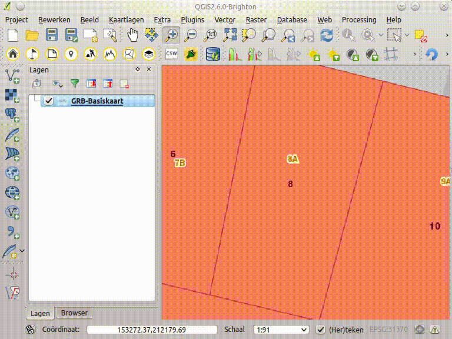

Zoek een Perceel
==============

 Met perceel service van geopunt kan je op getrapte wijze de ligging van een perceel zoeken. Je selecteert eerst de gemeente waarin je wenst te zoeken, daarna het departement en de sectie binnen het kadaster, dan krijg je een keuzelijst met alle perceelnummers binnen die sectie. 

Je kunt de geselecteerde percelen toevoegen de kaart als kaartlaag met de knop *Toevoegen aan  kaart* en je kunt zoomen naar elk niveau met de verrekijker knop, hierbij wordt ook de omtrek van dit niveau getoond.

Via instellingen (*op menubalk: plugins/geopunt4QGIS/instellingen*) kan je instellen of er wordt opgeslagen naar een tijdelijke laag of een permanent bestand (shapefile of spatialite). Let op, een tijdelijke laag ben je kwijt als je QGIS afsluit.

De data voor de service komt uit het [CADMAP](https://www.agiv.be/producten/kadastrale-perceelsplannen/meer-over/afgeleide-producten) product van AGIV, afgeleid uit de kadastrale plannen Algemene Administratie van de Patrimoniumdocumentatie (AAPD) van de FOD Financiën.

