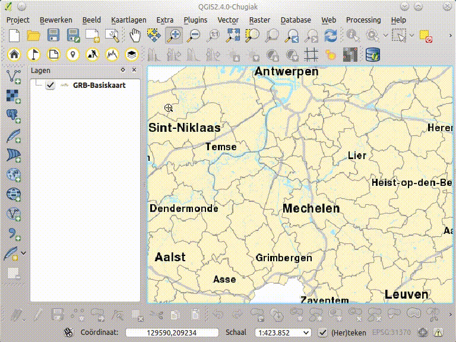

Zoek een Adres
==============

  
Op basis van een input string wordt gezocht naar een adres in [CRAB](http://www.agiv.be/gis/projecten/?catid=34). Je kiest de gemeente uit een selectielijst en geeft een adres op als input tekst.  De input tekst bevat verplicht een straatnaam en optioneel een huisnummer. Als output krijg je een lijst van strings in de vorm (straatnaam huisnummer, gemeente) die voldoen aan de selectie criteria. Het maximaal aantal elementen in de lijst is 25.

Je kan het gewenste adres selecteren door erop te klikken. Als je dubbel klikt op een adres of als je klikt op de knop **zoom naar** zoom je naar het adres. Met de knop **Toevoegen aan kaart** kan je het adres toevoegen als laag aan de kaart. Deze laag kan je gebruiken in analyses of voor cartografie. 

Als je meerdere adressen toevoegt komen die in dezelfde laag terecht. De laag bevat een attribuut '*type*' dat aangeeft hoe de locatie in crab bepaald werd en dus een indicatie geeft van de nauwkeurigheid.

Via instellingen (*op menubalk: plugins/geopunt4QGIS/instellingen*) kan je instellen of er wordt opgeslagen naar een tijdelijke laag of een permanent bestand (shapefile of spatialite). Let op een tijdelijke laag ben je kwijt als je QGIS afsluit.

[Foute adressen kunt u melden via LARA (enkel voor GDI-Vlaanderen)](http://crab.agiv.be/Lara) 