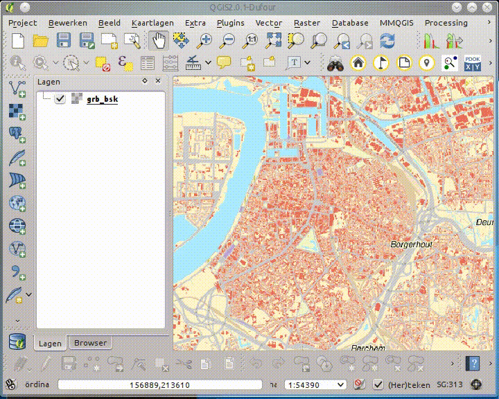

CSV-adresbestanden geocoderen
=============================

Met deze tool kan je een CSV-bestand geocoderen. CSV: Comma Seperated Values, een tekstbestand waarin de waarden door een teken (de separator) meestal een comma of puntcomma gescheiden zijn. Als je CSV-bestand adres gegevens bevat kan je deze met deze tool op de kaart weergeven met hun correct crab-adres.

#### Data inladen

Voor je een tekstbestand inlaad moet je de separator ingeven. Je kan ook de encoding instellen: 'utf-8' of 'ansi'. Dit is de set met speciale tekens die gebruikt worden. De meeste software in Vlaanderen gebruikt de 'utf-8' tekenset, maar als je een error krijgt bij inladen of sommige speciale tekens ( é, $, €, ...) worden niet coorect weergeven, dan moet nog eens proberen met de ansi-tekenset.

Als je data correct ingeladen hebt kan je de adres-kolom instellen. Als je huisnummer of gemeente (of postcode) in een andere kolom staan met je die  ook opgeven.

#### Data Valideren

Voor je de kaartlaag kunt aanmaken moet je de adressen valideren. Dit kan met de bovenste knop naast de tabel Hiermee worden alle adressen gevalideerd. Dit kan echter problemen opleveren met grote files omdat het AGIV de connectie bij langdurige verbindingen kan verbreken. Je krijgt dan een timeout error. 

Een beter systeem is de 2de knop te gebruiken (je kan die oproepen door rechts te klikken). Met deze knop valideer je enkel de geselecteerde rijen. Selecteer een 5 tot 10-tal rijen, valideer en controleer. 

#### Data controleren

Als een rij in groen wordt weergeven is er slechts 1 resultaat gevonden. Gele rijen bevatten meerdere opties voor valide adressen, selecteer de juiste uit de keuzelijst.  Je kan de ligging van een adres inspecteren met de derde knop (de verrekijker).

Bij rode rijen werden geen kanidaten gevonden. Je kan proberen door de tekst in de tabel aan te passen en opnieuw te valideren, een correct adres te bekomen. Als je geen correct resultaat vindt, kan je ook de locatie op de kaart prikken met de vierde knop (het vlagje). 

#### Toevoegen aan de kaart

Als je alle adressen die wenst toe te voegen hebt gevalideerd, kan je deze toevoegen via de knop **Voeg alle valide adressen toe aan de kaart**. De resulteerende kaartlaag bevat alle kolommen van de CSV plus gevalideerde adressen.

