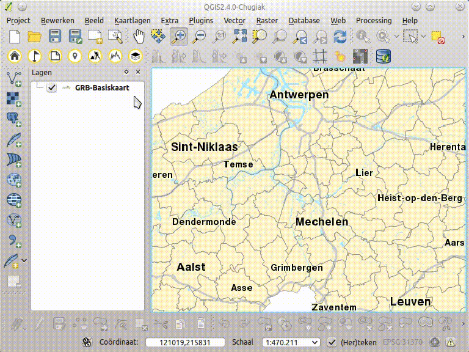

Zoek een Plaats - interesse punt
================================

 Met deze tool kan je de interesse punten (Points of Intrest: POI) in geopuntdiensten doorzoeken. Je moet een zoek tekst opgeven en verrekijker klikken om te zoeken. Je kan je zoekresultaten beperken tot het huidige kaartbeeld en je kunt verschillende filters kiezen. 

Er wordt een tabel met gevonden POI's weergegeven, inclusief de naam, de categorie en het correcte crabadres. Er worden maximaal 32 resultaten getoond.

Je kan in de resultaattabel gegevens selecteren om ze te doen oplichten op de kaart. Als je rechts klikt of op klikt op de knop **Zoom naar selectie** kan je naar de geselecteerde objecten zoomen.

Via de knop of contextmenu **Voeg selectie toe aan kaart** kan je de geselecteerde objecten toevoegen als een kaartlaag, die je kan gebruiken voor analyses of cartografie. De bevat de attributen: de naam, de categorie, het correcte crabadres en  tevens ook de link naar meer info over het punt, de datum van de laatste update en de eigenaar. 

Als er meer dan 32 resultaten zijn, kan je alle POI’s toevoegen die voldoen aan de criteria met de knop rechts onderaan. Dit is een versie met minder attribuutdata en indien er meer dan 1000 punten zijn, zal een gedeelte geclusterd worden.

Via instellingen (*op menubalk: plugins/geopunt4QGIS/instellingen*) kan je instellen of er wordt opgeslagen naar een tijdelijke laag of een permanent bestand (shapefile of spatialite). Let op een tijdelijke laag ben je kwijt als je QGIS afsluit.

De POI-zoekdienst van geopunt ontsluit het POI overheidsaanbod, aangevuld met POI's van de commerciële provider HERE (het vroegere navteq). De publieke POI’s mogen hergebruikt worden, de HERE POI’s niet.

 
