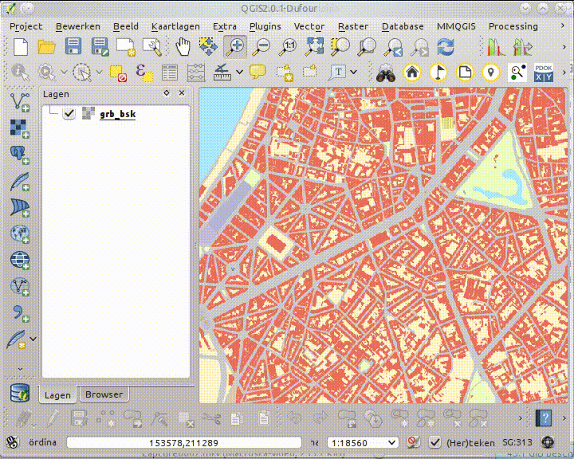

Prik een Adres op kaart
=======================

Met deze tool kan op een locatie (in Vlaanderen) op de kaart klikken om het correcte adres in [CRAB](http://www.agiv.be/gis/projecten/?catid=34) te weten te komen.
Het gevonden adres wordt weergegeven in een blauwe balk bovenaan de kaart. Met de knop **Voeg toe** kan je het adres als een kaartlaag toevoegen. Deze laag kan je gebruiken in analyses of voor cartografie.

Als je meerdere adressen toevoegt komen die in dezelfde laag terecht. De laag bevat een attribuut '*type*' dat aangeeft hoe de locatie in crab bepaald werd en geeft dus een indicatie van de nauwkeurigheid.

Via instellingen (*op menubalk: plugins/geopunt4QGIS/instellingen*) kan je instellen of er wordt opgeslagen naar een tijdelijke laag of een permanent bestand (shapefile of spatialite). Let op, een tijdelijke laag ben je kwijt als je QGIS afsluit.

[Foute adressen kunt u melden via LARA (enkel voor GDI-Vlaanderen)](http://crab.agiv.be/Lara) 
