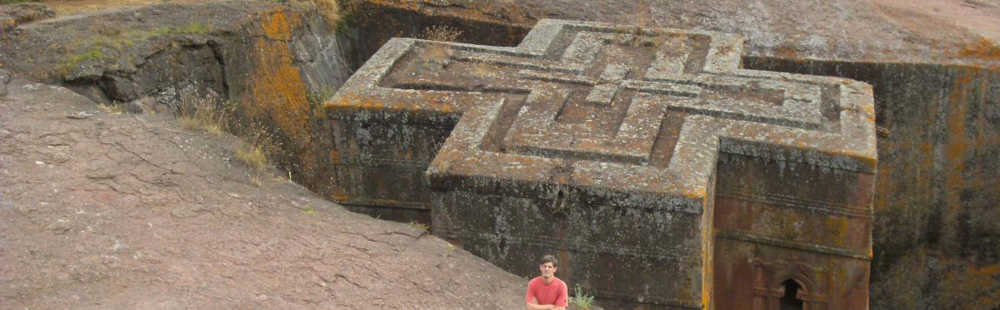

Kay Warrie
==========

Over mij
--------

Ik ben geodata analyst en occasioneel programmeur, werkzaam bij de Studiedienst van stad Antwerpen. 
Naast geohacking en kaartjes maken, houd ik van lezen, film kijken en reizen.

[Contacteer mij](mailto:kaywarrie@gmail.com)
 

Persoonlijke Projecten
---------

#### geopunt4Qgis

*"Geopunt voor QGIS"* is een plugin voor de [QGIS](http://www.qgis.org/) open source desktop GIS,  die toelaat op om de publieke webservices onder noemer [geopunt](http://www.geopunt.be) van het agiv (Vlaamse overheid) te bevragen en de data op slagen om in verdere analyses te gebruiken.

- [Meer info](README_NL.md) 
- [Op GitHub](http://github.com/warrieka/geopunt4Qgis)

Meer info over geopunt vind je hier: [http://www.geopunt.be/over-geopunt](http://www.geopunt.be/over-geopunt)

 

#### open-data-geoviewer

De open-data-Geoviewer is een mobile site gemaakt als demo voor de opendata-dag op 8 december 2012 in Antwerpen.

Wilt u weten waar het dichtstbijzijnde politiekantoor is of een hondenloopzones of een papiermand?
Met deze mobiele site (geoptimaliseerd voor smartphones) kunt u zeer eenvoudig een 20-tal verschillende soorten geografische data oproepen op een kaart (basiskaart open street map) of op een luchtfoto.
Met één klik krijgt u meer informatie (adres, foto, link) over het item.

[http://opendata.antwerpen.be/apps/open-data-geoviewer](http://opendata.antwerpen.be/apps/open-data-geoviewer)